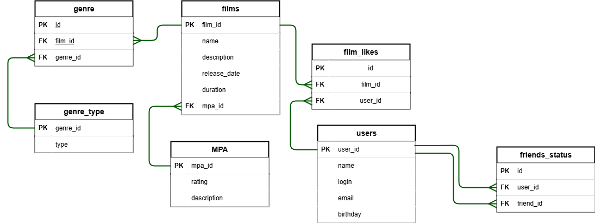

# ER-диаграмма базы данных java-filmorate

## Краткое описание диаграммы.
1. В базе данных 7 таблиц, связанных между собой связями "один ко многим".
2. Жанры к фильму добавляются через промежуточную таблицу genre, которая хранит в себе id фильма и id жанра, позволяя тем самым одному фильму присвоить несколько жанров.
3. В папке genre_type хранится информация о доступных через id типах жанров.
4. Список лайков к фильму реализован через отдельную таблицу film_likes, т.к. одному фильму можно добавить большое количество лайков.
5. Рейтинг фильму присваивается через mpa_id, а база данных по расшифровке этих id хранится в таблице MPA. Такое решение позволит изменить при необходимости условное обозначение рейтинга без надобности менять информацию в каждом фильме. 
6. Для пользователя из таблицы users информация о друзьях и о статусе дружбы (подтверждённая или нет) содержится в таблице friends_status. Дружба будет считаться подтвержденной если в таблице будут присутствовать записи подобного вида (user_1 - user_2 и user_2 - user_1).

## Примеры запросов.
<pre>
1.Вывести список фильмов (со всеми данными):
SELECT *
FROM films;

2. Вывести 10 лучших фильмов (названия):
SELECT f.name
FROM films AS f
INNER JOIN (SELECT film_id, 
                   COUNT(user_id) AS like_count
            FROM film_likes
            GROUP BY film_id
            ORDER BY like_count DESC
            LIMIT 10) AS l ON f.film_id = l.film_id
ORDER BY l.like_count DESC;

3. Вывести список всех пользователей (со всеми данными):
SELECT *
FROM users;

4. Вывести список имён всех друзей пользователя (например, с id = 7):
SELECT name
FROM users
WHERE user_id IN (SELECT friend_id
                  FROM friends_status
                  WHERE user_id = 7);

5. Вывести список имён общих друзей у пользователей 3 и 7:
SELECT u.name
FROM users AS u
WHERE user_id IN (SELECT fs.friend_id
                  FROM friend_status AS fs
                  INNER JOIN friend_status AS fr_st ON fs.friend_id = fr_st.friend_id
                  WHERE user_id = 3
                    AND user_id = 7);
</pre>